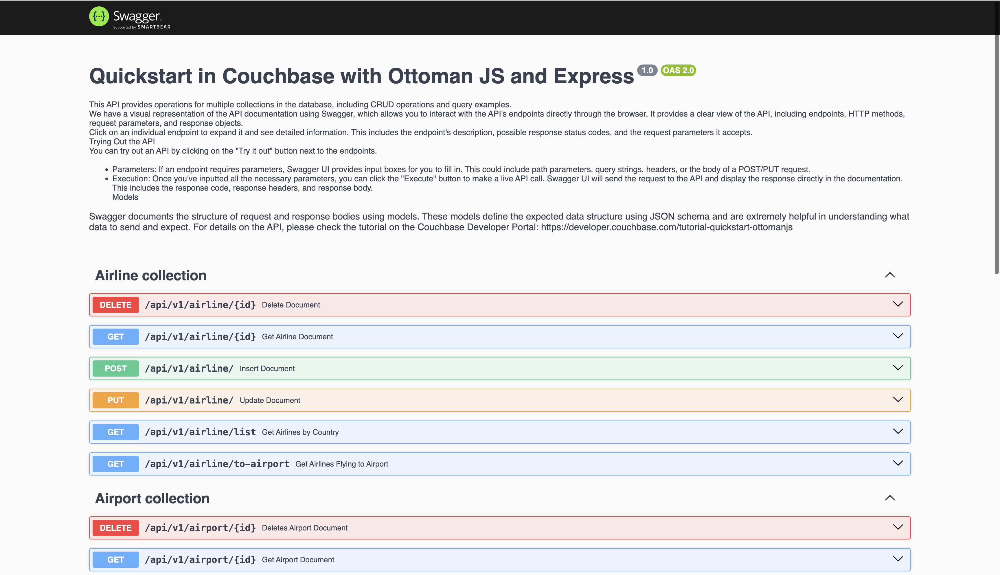

# Quickstart in Couchbase with Ottoman JS and Express

#### Build a REST API with Ottoman, Node JS and Express

Often, the first step developers do after creating their database is to create a REST API that can perform Create, Read, Update, and Delete (CRUD) operations for that database. This repo is designed to teach you and give you a starter project (in Ottoman JS using Express) to generate such a REST API. After you have installed travel-sample bucket in your database, you can run this application which is a REST API with Swagger documentation so that you can learn:

1. How to create, read, update, and delete documents using [Key Value operations](https://ottomanjs.com/docs/quick-start#persist-documents-to-our-bucket) (KV operations). KV operations are unique to couchbase and provide super fast (think microseconds) queries.
2. How to write simple parametrized [SQL++ queries](https://ottomanjs.com/docs/quick-start#write-a-query-with-ottomans-query-api) using the built-in travel-sample bucket.

Full documentation for the tutorial can be found on the [Couchbase Developer Portal](https://developer.couchbase.com/tutorial-quickstart-ottomanjs).

## Prerequisites

To run this prebuilt project, you will need:

- [Couchbase Capella](https://www.couchbase.com/products/capella/) cluster with [travel-sample](https://docs.couchbase.com/nodejs-sdk/current/ref/travel-app-data-model.html) bucket loaded.
  - To run this tutorial using a self managed Couchbase cluster, please refer to the [appendix](#running-self-managed-couchbase-cluster).
- [LTS Node.js Version](https://nodejs.org/en/download) installed on local machine.
- Basic knowledge of [JavaScript](https://developer.mozilla.org/en-US/docs/Learn/Getting_started_with_the_web/JavaScript_basics), [Ottoman](https://ottomanjs.com/docs/intro) and [Express](https://expressjs.com/)
- Loading Travel Sample Bucket
  If travel-sample is not loaded in your Capella cluster, you can load it by following the instructions for your Capella Cluster:
  - [Load travel-sample bucket in Couchbase Capella](https://docs.couchbase.com/cloud/clusters/data-service/import-data-documents.html#import-sample-data)

## App Setup

We will walk through the different steps required to get the application running.

### Cloning Repo

```shell
git clone https://github.com/couchbase-examples/ottomanjs-quickstart.git
```
## Install Dependencies

Any dependencies will be installed by running the npm install command, which installs any dependencies required for the project.

```sh
# Execute this command in the project's root directory
npm install
```

### Setup Database Configuration

To know more about connecting to your Capella cluster, please follow the [instructions](https://docs.couchbase.com/cloud/get-started/connect.html).

Specifically, you need to do the following:

- Create the [database credentials](https://docs.couchbase.com/cloud/clusters/manage-database-users.html) to access the travel-sample bucket (Read and Write) used in the application.
- [Allow access](https://docs.couchbase.com/cloud/clusters/allow-ip-address.html) to the Cluster from the IP on which the application is running.

#### Loading Travel Sample Bucket

If travel-sample is not loaded in your Capella cluster, you can load it by following the instructions for your Capella Cluster:

- [Load travel-sample bucket in Couchbase Capella](https://docs.couchbase.com/cloud/clusters/data-service/import-data-documents.html#import-sample-data)

All configuration for communication with the database is read from the environment variables. We have provided a convenience feature in this quickstart to read the environment variables from a local file, `config/dev.env.example`.

Create a copy of `dev.env.example` file and rename it to `dev.env` and add the values for the Couchbase connection.

```sh
DB_CONN_STR=<connection_string>
DB_USERNAME=<user_with_read_write_permission_to_travel-sample_bucket>
DB_PASSWORD=<password_for_user>
```

> Note: The connection string expects the `couchbases://` or `couchbase://` part.

## Running The Application

### Directly on machine

At this point, we have installed the dependencies, loaded the travel-sample data and configured the application with the credentials. The application is now ready and you can run it.

The application will run on port 3000 of your local machine (http://localhost:3000). You will find the Swagger documentation of the API.

```sh
# Execute this command in the project's root directory
npm start
```

### Using Docker

- Build the Docker image

```sh
# Execute this command in the project's root directory
docker build -t couchbase-ottoman-express-js-quickstart .
```

- Run the Docker image

```sh
# Execute this command in the project's root directory
docker run -it --env-file config/dev.env -p 3000:3000 couchbase-ottoman-express-js-quickstart
```

> Note: The `config/dev.env` file has the connection information to connect to your Capella cluster. These will be part of the environment variables in the Docker container.

### Verifying the Application

Once the application starts, you can see the details of the application on the terminal.


The application will run on port 3000 of your local machine (http://localhost:3000). You will find the interactive Swagger documentation of the API if you go to the URL in your browser. Swagger documentation is used in this demo to showcase the different API end points and how they can be invoked. More details on the Swagger documentation can be found in the [appendix](#swagger-documentation).



## Running The Tests

Create a copy of `config/test.env.example` file and rename it to `config/test.env` and add the values for the Couchbase connection.

To run the standard tests, use the following commands:

```sh
# Execute this command in the project's root directory
npm test
```

## Appendix
### Data Model

For this quickstart, we use three collections, `airport`, `airline` and `routes` that contain sample airports, airlines and airline routes respectively. The routes collection connects the airports and airlines as seen in the figure below. We use these connections in the quickstart to generate airports that are directly connected and airlines connecting to a destination airport. Note that these are just examples to highlight how you can use SQL++ queries to join the collections.


### Extending API by Adding New Entity

If you would like to add another entity to the APIs, these are the steps to follow:

- **Create the New Entity in Couchbase Bucket:**
  - Utilize the [Couchbase Server interface](https://docs.couchbase.com/cloud/n1ql/n1ql-language-reference/createcollection.html) to establish the new collection within the Couchbase bucket.

- **Define the New Route:**
  - Navigate to the `src/routes` folder and create the new route.

- **Controller Configuration:**
  - Develop a new file in the `controllers` folder, mirroring the existing structures (e.g., `airportController.js`). Craft the corresponding method within this file to manage the new entity.


- **Add Tests:**
  - Add the tests for the new routes in a new file in the `__test__` folder similar to other collection tests.

Following these steps ensures a systematic and organized approach to expanding the API functionality with a new entity.

### Understanding How Ottoman Works and Extending Functionality

#### Key Generation Layer:
Ottoman simplifies key management by introducing an abstraction layer for handling keys used to store and access documents on the Couchbase database. Developers work with document IDs, while Ottoman automatically manages the keys for them.

#### keyGenerator Function:
The keyGenerator function is crucial in Ottoman's key generation process. The default function combines the model name with a unique identifier to form the key. Developers can override this function to customize key generation.

Example using the default keyGenerator:
```js
const keyGenerator = ({ metadata }) => `${metadata.modelName}::0477024c`;
```

Example overriding keyGenerator:
```js
const keyGenerator = ({ metadata }) => `${metadata.scopeName}::0477024c`;
const User = model('User', schema, { keyGenerator, scopeName: 'myScope' });
```

#### Extending Ottoman Functionality:
Developers can extend Ottoman's functionality by customizing the keyGenerator function. This allows for modifications to key generation logic, including prefix changes or removal. By understanding Ottoman's internal workings, developers gain the flexibility to tailor the library to specific project requirements.

For more in-depth information, refer to the [Ottoman Documentation on How Ottoman Works](https://ottomanjs.com/docs/advanced/how-ottoman-works).


### Running Self Managed Couchbase Cluster

If you are running this quickstart with a self managed Couchbase cluster, you need to [load](https://docs.couchbase.com/server/current/manage/manage-settings/install-sample-buckets.html) the travel-sample data bucket in your cluster and generate the credentials for the bucket by [creating a user](https://docs.couchbase.com/server/current/manage/manage-security/manage-users-and-roles.html#add-a-user).

You need to update the connection string and the credentials in the `config/dev.env` file.

> Note: Couchbase Server must be installed and running prior to running this app.
### Swagger Documentation

Swagger documentation provides a clear view of the API including endpoints, HTTP methods, request parameters, and response objects.

Click on an individual endpoint to expand it and see detailed information. This includes the endpoint's description, possible response status codes, and the request parameters it accepts.

#### Trying Out the API

You can try out an API by clicking on the "Try it out" button next to the endpoints.

- Parameters: If an endpoint requires parameters, Swagger UI provides input boxes for you to fill in. This could include path parameters, query strings, headers, or the body of a POST/PUT request.

- Execution: Once you've inputted all the necessary parameters, you can click the "Execute" button to make a live API call. Swagger UI will send the request to the API and display the response directly in the documentation. This includes the response code, response headers, and response body.

#### Models

Swagger documents the structure of request and response bodies using models. These models define the expected data structure using JSON schema and are extremely helpful in understanding what data to send and expect.
